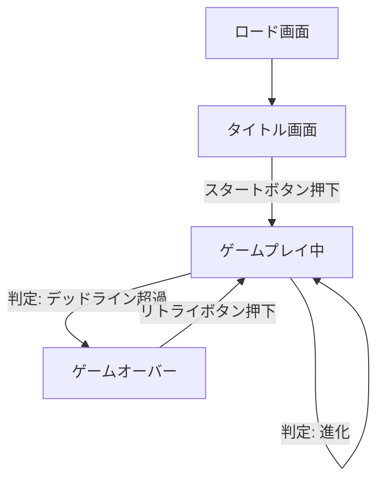

# とっとりVOICE スイカゲーム風プロジェクト 仕様書 (MVP)

## 1. 画面構成 (UI/UX)
画面はPC・スマホ両対応（レスポンシブ）とし、以下のレイアウトで構成します。

### 全体レイアウト
- **背景:** 賑やかすぎず、キャラクターが映えるシンプルなグラデーションまたはパターン（とっとりVOICEのイメージカラーを採用）。
- **メインエリア:** 画面中央に配置。物理演算が適用されるゲームフィールド。
- **UIエリア:** 画面上部またはメインエリア周辺に配置。

### 画面内訳
1.  **ヘッダー / ステータスバー**
    - **現在スコア:** 大きく視認性良く表示。
    - **ハイスコア:** 控えめに表示（ローカルストレージ保存）。
2.  **NEXT表示エリア**
    - 次に落ちてくるキャラクター（Lv.1〜Lv.5程度まで）をプレビュー表示。
    - 右上または左上に配置。
3.  **ゲームフィールド（コンテナ）**
    - 形状: 縦長の長方形（U字型の箱）。
    - 上部に「デッドライン（ゲームオーバーライン）」を破線で表示。
4.  **コントロールエリア（スマホ版のみ意識）**
    - 画面全体がタップ操作領域となるため、明示的なボタンは不要だが、操作ガイドを表示する。

## 2. 状態遷移図

### 各状態の詳細
- **タイトル画面:**
    - ゲームタイトルロゴ
    - 「START」ボタン（アニメーション付き）
- **ゲームプレイ中:**
    - ユーザー操作（移動・投下）を受け付け。
    - 物理演算のリアルタイム実行。
    - 進化エフェクト（ポップアクション）。
- **ゲームオーバー:**
    - 画面が暗転し、結果ポップアップを表示。
    - 「最終スコア」「ハイスコア更新などのメッセージ」。
    - 「もう一度遊ぶ」ボタン。

## 3. キャラクター進化ルール & パラメータ
キャラクターは円形（Circle）として定義し、Matter.jsのBodyとして生成します。

### 進化テーブル
進化は Lv.1 同士が衝突すると Lv.2 になり、最終的に Lv.11 を目指します。

| レベル | 画像ファイル | サイズ比率(半径) | 加算スコア | 物理特性(反発/摩擦) |
| :--- | :--- | :--- | :--- | :--- |
| **Lv.1** | `simple.png` | 1.0 (基準) | - | 軽め・よく跳ねる |
| **Lv.2** | `fumufumu.jpeg` | 1.3 | 2 | |
| **Lv.3** | `ageru.jpeg` | 1.6 | 4 | |
| **Lv.4** | `ureshi.jpeg` | 2.0 | 8 | |
| **Lv.5** | `yatta.jpeg` | 2.4 | 16 | |
| **Lv.6** | `love.jpeg` | 2.9 | 32 | |
| **Lv.7** | `IMG_0453.PNG` | 3.5 | 64 | |
| **Lv.8** | `IMG_0454.PNG` | 4.1 | 128 | |
| **Lv.9** | `IMG_0455.PNG` | 4.8 | 256 | |
| **Lv.10** | `IMG_0456.PNG` | 5.6 | 512 | 重め |
| **Lv.11** | `アイコン.png` | 6.5 (最大) | 1000 | ずっしり・跳ねにくい |

※ **出現ロジック:** プレイヤーが落とせるのは **Lv.1 〜 Lv.5** までのランダム（確率は低いレベルほど高く設定）。

## 4. スコア計算ルール
- **進化ボーナス:** 進化した瞬間に、生成されたキャラクターのレベルに応じたスコアを加算。
- **連鎖ボーナス（オプション）:** 同時多発的に進化した場合の係数（MVPでは実装しないが考慮に入れておく）。

## 5. UI要素一覧 (技術仕様)
HTML/CSSで実装するDOM要素と、Canvas描画要素の切り分け。

### DOM要素（HTML/CSS）
- **UIレイヤー:** ゲームCanvasの上に重ねる。
    - スコア表示 (`#score-board`)
    - 次のキャラ表示 (`#next-character-display`)
    - ゲームオーバー画面 (`#game-over-screen`)
        - リザルトスコア
        - リトライボタン

### Canvas描画要素（Matter.js）
- **壁・床:** 静的ボディ（Static Body）。
- **キャラクター:** 動的ボディ（Dynamic Body）。テクスチャマッピングを使用。
- **ガイドライン:** 現在の投下位置を示す点線（操作中のみ表示）。
- **デッドライン:** 赤い破線。

## 6. 技術スタック & ライブラリ
- **言語:** HTML5, CSS3 (Vanilla), JavaScript (ES6+)
- **物理エンジン:** [Matter.js](https://brm.io/matter-js/) (CDN読み込み)
- **画像処理:** CSS `border-radius: 50%` (プレビュー用), Matter.js Sprite (ゲーム内)
    - ※JPEG画像など四角い画像は、Canvas描画時に`ctx.globalCompositeOperation = 'destination-in'`等を使って円形に切り抜くか、SVGマスクを使用するか、あるいはMatter.jsのレンダリングフックで円形描画を行う。

## 7. 開発ステップ（実装計画）
1.  **環境構築 & Matter.js導入:** 空のHTMLに物理演算フィールドを作成。
2.  **キャラクター定義:** 画像を読み込み、物理ボディとして生成するクラスを作成。
3.  **落下・操作の実装:** クリック/タップ位置に生成、物理挙動の調整。
4.  **マージ（進化）処理:** 衝突判定イベント(`collisionStart`)の実装とオブジェクト置換。
5.  **ゲームサイクル実装:** スコア計算、ネクスト表示、ゲームオーバー判定。
6.  **UI/デザイン調整:** とっとりVOICEらしい配色とデザイン適用。
